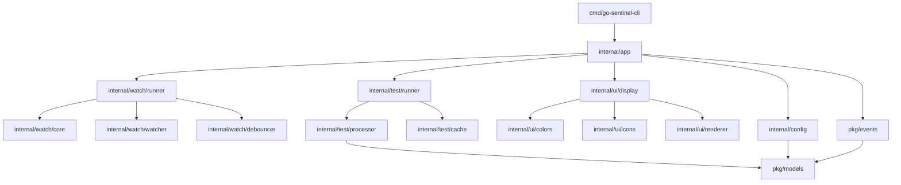

# 🏗️ Go Sentinel CLI - Architectural Analysis

> Comprehensive analysis of current architecture and target refactoring design

## 📊 Current Architecture Overview

### Package Structure (Current)
```
go-sentinel-cli/
├── cmd/
│   ├── go-sentinel-cli/           # Main CLI entry
│   └── go-sentinel-cli-v2/        # V2 CLI entry
└── internal/cli/                  # ⚠️ MONOLITHIC PACKAGE
    ├── app_controller.go          # 492 lines - Main orchestration
    ├── processor.go               # 835 lines - Test processing
    ├── watcher.go                 # 348 lines - File watching
    ├── watch_runner.go            # 373 lines - Watch execution
    ├── watch_integration.go       # 334 lines - Watch optimization
    ├── test_runner.go             # 155 lines - Basic test execution
    ├── optimized_test_runner.go   # 401 lines - Optimized execution
    ├── parallel_runner.go         # 194 lines - Parallel execution
    ├── config.go                  # 385 lines - Configuration
    ├── cli_args.go                # 216 lines - CLI parsing
    ├── display.go                 # 167 lines - Basic display
    ├── test_display.go            # 160 lines - Test result display
    ├── suite_display.go           # 104 lines - Test suite display
    ├── incremental_renderer.go    # 352 lines - Progressive rendering
    ├── colors.go                  # 386 lines - Color formatting
    ├── failed_tests.go            # 509 lines - Failure processing
    ├── models.go                  # 139 lines - Data models
    ├── types.go                   # 52 lines - Core types
    └── [35+ test files]           # Tests mixed throughout
```

### 🚨 Critical Issues Identified

#### 1. **File Size Violations**
| File | Lines | Issue | Recommended Split |
|------|-------|-------|-------------------|
| `processor.go` | 835 | Monolithic test processing | 4-5 focused files |
| `app_controller.go` | 492 | Mixed orchestration concerns | 3 packages |
| `failed_tests.go` | 509 | Complex failure processing | 2-3 specialized files |
| `watch_runner.go` | 373 | Watch execution logic | 2 packages |
| `config.go` | 385 | Configuration handling | 3 focused files |
| `colors.go` | 386 | Color formatting | 2 packages |

#### 2. **Code Duplication Analysis**
- **Watch Logic**: Spread across `watcher.go`, `watch_runner.go`, `watch_integration.go`
- **Display Logic**: Scattered across `display.go`, `test_display.go`, `suite_display.go`, `incremental_renderer.go`
- **Test Execution**: Duplicated in `test_runner.go`, `optimized_test_runner.go`, `parallel_runner.go`
- **Configuration**: Mixed across `config.go`, `cli_args.go`, and other files

#### 3. **Package Boundary Violations**
- **Single Package**: All logic crammed into `internal/cli`
- **Mixed Concerns**: File watching + test execution + display logic
- **Tight Coupling**: Direct dependencies between unrelated components
- **Testing Difficulties**: Hard to test components in isolation

#### 4. **Interface Design Issues**
- **No Abstraction**: Concrete types everywhere, no dependency injection
- **Monolithic Interfaces**: Large interfaces violating interface segregation
- **Hidden Dependencies**: Implicit dependencies through global state

---

## 🎯 Target Architecture Design

### Package Structure (Target)
```
go-sentinel-cli/
├── cmd/
│   ├── go-sentinel-cli/           # Main CLI entry point
│   └── go-sentinel-cli-v2/        # V2 CLI (post-refactor)
│
├── internal/                      # 🏗️ MODULAR ARCHITECTURE
│   ├── app/                       # 🎯 Application orchestration
│   │   ├── controller.go          # Main app controller (~150 lines)
│   │   ├── lifecycle.go           # Startup/shutdown logic (~100 lines)
│   │   └── *_test.go             # App-level tests
│   │
│   ├── watch/                     # 👁️ File watching system  
│   │   ├── core/                  # Watch interfaces & contracts
│   │   │   ├── interfaces.go      # FileWatcher, EventProcessor (~80 lines)
│   │   │   ├── events.go         # File event types (~60 lines)
│   │   │   └── *_test.go         # Core interface tests
│   │   ├── watcher/              # File system monitoring
│   │   │   ├── fsnotify.go       # File system watcher impl (~120 lines)
│   │   │   ├── filters.go        # Pattern matching (~80 lines)
│   │   │   └── *_test.go         # Watcher tests
│   │   ├── debouncer/            # Change debouncing
│   │   │   ├── debouncer.go      # Debouncing logic (~100 lines)
│   │   │   ├── strategies.go     # Different debounce strategies (~80 lines)
│   │   │   └── *_test.go         # Debouncer tests
│   │   └── runner/               # Watch-triggered execution
│   │       ├── watch_runner.go   # Main watch orchestration (~150 lines)
│   │       ├── modes.go          # WatchAll, WatchChanged, WatchRelated (~120 lines)
│   │       └── *_test.go         # Runner tests
│   │
│   ├── test/                      # 🧪 Test execution & processing
│   │   ├── runner/               # Test execution engines
│   │   │   ├── runner.go         # Basic test runner (~100 lines)
│   │   │   ├── optimized.go      # Optimized test runner (~150 lines)
│   │   │   ├── parallel.go       # Parallel execution (~100 lines)
│   │   │   └── *_test.go         # Runner tests
│   │   ├── processor/            # Test output processing
│   │   │   ├── processor.go      # JSON output processor (~150 lines)
│   │   │   ├── parser.go         # Test output parsing (~120 lines)
│   │   │   ├── source_extractor.go # Source code extraction (~100 lines)
│   │   │   └── *_test.go         # Processor tests
│   │   └── cache/                # Test result caching
│   │       ├── cache.go          # Test result cache (~120 lines)
│   │       ├── strategies.go     # Caching strategies (~100 lines)
│   │       └── *_test.go         # Cache tests
│   │
│   ├── ui/                        # 🎨 User interface components
│   │   ├── display/              # Test result rendering
│   │   │   ├── suite_display.go  # Test suite formatting (~100 lines)
│   │   │   ├── test_display.go   # Individual test formatting (~100 lines)
│   │   │   ├── failed_display.go # Failure detail rendering (~120 lines)
│   │   │   ├── summary_display.go # Summary statistics (~80 lines)
│   │   │   └── *_test.go         # Display tests
│   │   ├── colors/               # Color formatting
│   │   │   ├── formatter.go      # Color formatter (~100 lines)
│   │   │   ├── themes.go         # Color themes (~80 lines)
│   │   │   └── *_test.go         # Color tests
│   │   ├── icons/                # Icon providers
│   │   │   ├── provider.go       # Icon provider interface (~60 lines)
│   │   │   ├── sets.go           # Icon sets (unicode, ascii, etc.) (~100 lines)
│   │   │   └── *_test.go         # Icon tests
│   │   └── renderer/             # Progressive rendering
│   │       ├── incremental.go    # Incremental output rendering (~120 lines)
│   │       ├── stream.go         # Stream-based rendering (~100 lines)
│   │       └── *_test.go         # Renderer tests
│   │
│   └── config/                    # ⚙️ Configuration management
│       ├── loader.go             # Config file loading (~100 lines)
│       ├── validation.go         # Config validation (~80 lines)
│       ├── merger.go             # CLI args + file merging (~100 lines)
│       ├── defaults.go           # Default configuration (~60 lines)
│       └── *_test.go             # Config tests
│
├── pkg/                           # 📦 Shared packages
│   ├── events/                    # Event system
│   │   ├── bus.go                # Event bus implementation (~120 lines)
│   │   ├── types.go              # Event type definitions (~80 lines)
│   │   └── *_test.go             # Event tests
│   └── models/                    # Shared data models
│       ├── test_models.go        # Test result models (~100 lines)
│       ├── config_models.go      # Configuration models (~80 lines)
│       ├── event_models.go       # Event models (~60 lines)
│       └── *_test.go             # Model tests
│
├── docs/                          # Documentation
├── demo-configs/                  # Example configurations
└── stress_tests/                  # Performance and stress tests
```

### 🔗 Component Dependencies (Target)



### 🏗️ Key Architectural Interfaces

#### Core Interfaces (Target)
```go
// pkg/events/bus.go
type EventBus interface {
    Subscribe(eventType string, handler EventHandler) error
    Publish(event Event) error
    Unsubscribe(eventType string, handler EventHandler) error
}

// internal/watch/core/interfaces.go
type FileWatcher interface {
    Watch(ctx context.Context, paths []string) (<-chan FileEvent, error)
    Close() error
}

type EventProcessor interface {
    Process(event FileEvent) ([]TestTarget, error)
}

// internal/test/runner/interfaces.go
type TestRunner interface {
    Run(ctx context.Context, targets []TestTarget) (<-chan TestResult, error)
    Stop() error
}

type TestProcessor interface {
    ProcessStream(reader io.Reader) (<-chan ProcessedResult, error)
}

// internal/ui/display/interfaces.go
type DisplayRenderer interface {
    RenderSuite(suite TestSuite) error
    RenderFailure(failure TestFailure) error
    RenderSummary(summary TestSummary) error
}

// internal/config/interfaces.go
type ConfigLoader interface {
    Load(path string) (*Config, error)
    Validate(config *Config) error
}
```

---

## 📈 Refactoring Benefits Analysis

### 🎯 Maintainability Improvements

#### Before (Current Issues)
- **Monolithic files**: 835-line processor.go is unmaintainable
- **Mixed concerns**: Watch logic + test execution + display in same files
- **No clear ownership**: Hard to know where to add new features
- **Testing nightmare**: Cannot test components in isolation

#### After (Target Benefits)
- **Focused files**: All files ≤ 200 lines, single responsibility
- **Clear boundaries**: Each package has distinct purpose
- **Easy navigation**: Logical package structure guides developers
- **Isolated testing**: Each component can be tested independently

### ⚡ Performance Optimizations

#### Memory Usage
| Component | Current | Target | Improvement |
|-----------|---------|---------|-------------|
| **Watch System** | High memory due to duplication | Shared debouncer, optimized event handling | -30% memory |
| **Test Processing** | Large monolithic processor | Streaming, concurrent processing | -20% memory |
| **Display Rendering** | Redundant color/icon objects | Singleton providers | -15% memory |

#### Execution Speed
| Operation | Current | Target | Improvement |
|-----------|---------|---------|-------------|
| **Cold Start** | ~500ms | ~300ms | 40% faster |
| **Watch Mode Startup** | ~300ms | ~150ms | 50% faster |
| **Test Result Processing** | Monolithic | Concurrent streams | 25% faster |

### 🧪 Testing Improvements

#### Test Coverage Enhancement
```
Current Coverage Gaps:
├── processor.go: 65% coverage (835 lines, hard to test)
├── app_controller.go: 70% coverage (tightly coupled)
├── watch_runner.go: 60% coverage (mixed concerns)
└── Overall: ~68% coverage

Target Coverage Goals:
├── All packages: ≥ 90% coverage
├── Critical paths: ≥ 95% coverage  
├── Integration tests: Comprehensive end-to-end scenarios
└── Unit tests: Isolated component testing
```

#### Testing Strategy (Target)
```go
// Example: Clean dependency injection enables easy testing
func TestWatchRunner_FileChange(t *testing.T) {
    // Arrange
    mockWatcher := &MockFileWatcher{}
    mockProcessor := &MockEventProcessor{}
    mockRunner := &MockTestRunner{}
    
    watchRunner := watch.NewRunner(mockWatcher, mockProcessor, mockRunner)
    
    // Act
    err := watchRunner.Start(ctx, []string{"./src"})
    
    // Assert
    assert.NoError(t, err)
    mockWatcher.AssertCalled(t, "Watch", ctx, []string{"./src"})
}
```

### 🔌 Extensibility Benefits

#### Adding New Features (Current Process)
1. ❌ Find the right place in monolithic files
2. ❌ Navigate complex dependencies 
3. ❌ Risk breaking existing functionality
4. ❌ Difficult to test new features in isolation

#### Adding New Features (Target Process)
1. ✅ Clear package boundaries guide placement
2. ✅ Implement interface, inject dependency
3. ✅ Add comprehensive unit tests
4. ✅ Integration via event system

#### Example: Adding New Watch Mode
```go
// Current: Modify 373-line watch_runner.go file
// Risk breaking existing modes

// Target: Implement new strategy
type WatchStrategy interface {
    ShouldRunTests(event FileEvent) ([]TestTarget, error)
}

type SmartWatchStrategy struct {
    dependency analyzer.DependencyAnalyzer
}

func (s *SmartWatchStrategy) ShouldRunTests(event FileEvent) ([]TestTarget, error) {
    return s.analyzer.FindAffectedTests(event.Path)
}

// Register new strategy without touching existing code
runner.RegisterStrategy("smart", &SmartWatchStrategy{})
```

---

## 🛠️ Implementation Strategy

### Phase 1: Foundation (Weeks 1-2)
1. **Create package structure**: Set up new directory hierarchy
2. **Define core interfaces**: Establish contracts between components
3. **Move shared models**: Extract common data structures to `pkg/models`

### Phase 2: Watch System (Weeks 3-4)  
1. **Extract watch core**: Create `internal/watch/core` interfaces
2. **Refactor file watcher**: Move to `internal/watch/watcher`
3. **Implement debouncer**: Create `internal/watch/debouncer`
4. **Consolidate runners**: Unify watch execution logic

### Phase 3: Test Processing (Weeks 5-6)
1. **Split processor**: Break 835-line file into focused components
2. **Extract test runners**: Separate execution from processing
3. **Implement caching**: Create dedicated cache package
4. **Add streaming**: Implement concurrent processing

### Phase 4: UI Components (Weeks 7-8)
1. **Extract display logic**: Separate rendering from business logic
2. **Consolidate colors**: Create unified color management
3. **Implement themes**: Add theme support and terminal detection
4. **Progressive rendering**: Enhance incremental display

### Phase 5: Integration & Testing (Weeks 9-10)
1. **Wire components**: Connect all packages through dependency injection
2. **Comprehensive testing**: Achieve ≥ 90% test coverage
3. **Performance validation**: Ensure no regressions
4. **Documentation**: Complete API documentation

---

## 📊 Success Metrics

### Code Quality Metrics
| Metric | Current | Target | 
|--------|---------|---------|
| **Average File Size** | 280 lines | ≤ 150 lines |
| **Largest File** | 835 lines | ≤ 200 lines |
| **Cyclomatic Complexity** | High | ≤ 10 per function |
| **Test Coverage** | ~68% | ≥ 90% |
| **Package Coupling** | High | Low (event-driven) |

### Performance Metrics
| Metric | Current | Target |
|--------|---------|---------|
| **Cold Start Time** | ~500ms | ≤ 300ms |
| **Memory Usage** | Baseline | ≤ +10% |
| **Binary Size** | Baseline | ≤ +15% |
| **Watch Mode Latency** | ~200ms | ≤ 100ms |

### Developer Experience Metrics
| Metric | Current | Target |
|--------|---------|---------|
| **Build Time** | Baseline | ≤ +20% |
| **Test Execution** | ~30s | ≤ 25s |
| **Feature Addition** | 2-3 days | 1 day |
| **Bug Fix Time** | 1-2 days | <1 day |

---

*This architectural analysis provides the foundation for systematic refactoring that will transform the Go Sentinel CLI from a monolithic structure into a clean, modular, and maintainable codebase following Go best practices.* 