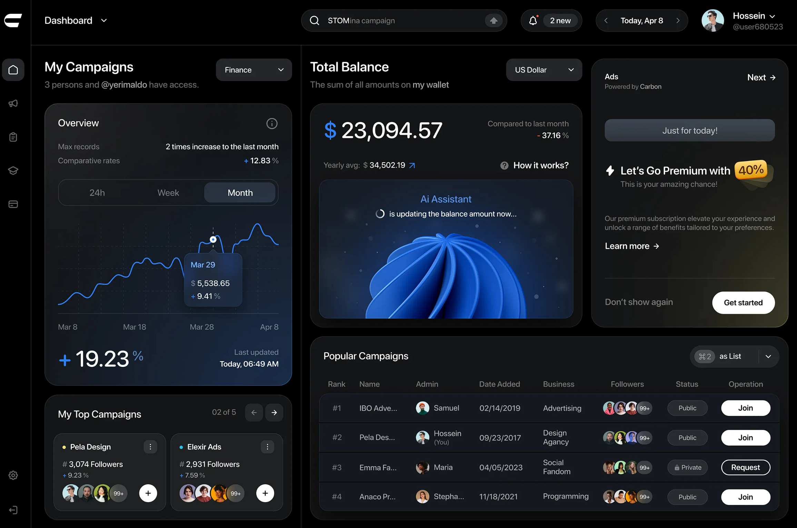

# Go Sentinel Web Frontend Roadmap

---
**Frontend Tech Stack Reference**
- **Styling:** TailwindCSS (installed via npm, built with PostCSS)
- **Dynamic UI:** HTMX (included via CDN in base layout)
- **Testing:**
  - Unit/Integration: Jest
  - End-to-End (E2E): Playwright (recommended for modern HTMX apps)

**Best Practices:**
- Use Tailwind's CLI to scan HTML templates for class usage and build pruned CSS to static/css/tailwind.build.css
- Use HTMX attributes in HTML for dynamic interactivity
- Write E2E tests for HTMX-driven UI using Playwright (simulate user actions, assert DOM updates)
---


This roadmap outlines the development plan for the Go Sentinel web interface using HTMX and WebSockets for real-time updates. Following our TDD approach, each implementation task is preceded by its corresponding test task.



## Phase 1: Frontend Foundation & Structure

- [ ] **1.1. Web Project Structure Setup**
  - [x] 1.1.1. Create web-specific directory structure
    ```
    web/                  # Web frontend root
    ├── static/           # Static assets (CSS, JS, images)
    │   ├── css/          # Stylesheets
    │   ├── js/           # JavaScript files (minimal)
    │   └── images/       # Icons, logos, etc.
    ├── templates/        # HTML templates
    │   ├── layouts/      # Base layouts
    │   ├── partials/     # Reusable components
    │   └── pages/        # Full page templates
    └── tests/            # Frontend tests
    ```
  - [x] 1.1.2. Set up essential dependencies (HTMX, CSS framework)
  - [x] 1.1.3. Create basic template structure with layouts and partials
  - [x] 1.1.4. Add .env or config for API base URL
  - [ ] 1.1.5. Write test: API health check (frontend can reach /health)

- [ ] **1.2. Base Template & Design System**
  - [ ] 1.2.1. Write tests for responsive layout
    - [ ] Test: Layout renders correctly at different viewport sizes
    - [ ] Test: Components maintain proper spacing and alignment
    - [ ] Test: Dashboard accurately reflects provided design image
  - [ ] 1.2.2. Implement base templates and design system
    - [ ] Create master layout with CSS framework integration
    - [ ] Implement responsive grid system matching dashboard design
    - [ ] Set up typography, color palette, and spacing system
    - [ ] Add common UI components (buttons, cards, icons)

## Phase 2: Real-Time Data Connection with HTMX & WebSockets

- [ ] **2.1. HTMX WebSocket Integration**
  - [ ] 2.1.1. Write tests for HTMX WebSocket connection
    - [ ] Test: Establish WebSocket connection on page load
    - [ ] Test: Reconnect mechanism for dropped connections
    - [ ] Test: Proper event binding to DOM updates
  - [ ] 2.1.2. Implement HTMX WebSocket wrapper
    - [ ] Set up WebSocket connection with HTMX extensions
    - [ ] Create automatic reconnection logic
    - [ ] Implement message type routing

- [ ] **2.2. Server-Sent Event Fallback**
  - [ ] 2.2.1. Write tests for SSE fallback
    - [ ] Test: Detect WebSocket failure and fall back to SSE
    - [ ] Test: Receive and process SSE events
    - [ ] Test: Handle reconnection for SSE stream
  - [ ] 2.2.2. Implement SSE fallback mechanism
    - [ ] Create SSE connection handler
    - [ ] Set up HTMX bindings for SSE events
    - [ ] Implement graceful degradation from WebSockets to SSE

## Phase 3: Core Dashboard Components

- [ ] **3.1. Header Component & Navigation**
  - [ ] 3.1.1. Write tests for header component
    - [ ] Test: Navigation links work correctly
    - [ ] Test: Responsive behavior on different screen sizes
    - [ ] Test: Active state for current section
  - [ ] 3.1.2. Implement header component
    - [ ] Create logo and application title section
    - [ ] Add main navigation with proper active states
    - [ ] Implement responsive behavior (desktop/mobile)

- [ ] **3.2. Dashboard Overview Component**
  - [ ] 3.2.1. Write tests for dashboard overview
    - [ ] Test: Display summary statistics (pass/fail/total)
    - [ ] Test: Render test duration charts
    - [ ] Test: Update in real-time via WebSocket
  - [ ] 3.2.2. Implement dashboard overview component
    - [ ] Create statistics tiles with appropriate styling
    - [ ] Add charts for visualizing test metrics
    - [ ] Implement real-time updates via HTMX + WebSockets

- [ ] **3.3. Test Results List Component**
  - [ ] 3.3.1. Write tests for test results list
    - [ ] Test: Render list of test results with status indicators
    - [ ] Test: Sort and filter functionality
    - [ ] Test: Real-time updates as tests complete
  - [ ] 3.3.2. Implement test results list component
    - [ ] Create expandable test result rows
    - [ ] Add status indicators (pass/fail/running)
    - [ ] Implement sorting and filtering capabilities
    - [ ] Set up real-time updates via HTMX + WebSockets

- [ ] **3.4. Test Detail Component**
  - [ ] 3.4.1. Write tests for test detail component
    - [ ] Test: Display test output and error details
    - [ ] Test: Show source code context for failures
    - [ ] Test: Expand/collapse sections for readability
  - [ ] 3.4.2. Implement test detail component
    - [ ] Create detailed view for test output
    - [ ] Add source code context with syntax highlighting
    - [ ] Implement expandable sections for test details

## Phase 4: Interactive Test Controls

- [ ] **4.1. Test Execution Controls**
  - [ ] 4.1.1. Write tests for test execution controls
    - [ ] Test: Run all tests button functionality
    - [ ] Test: Run selected tests button functionality
    - [ ] Test: Cancel running tests functionality
  - [ ] 4.1.2. Implement test execution controls
    - [ ] Create run controls buttons and UI
    - [ ] Add WebSocket command sending for test runs
    - [ ] Implement loading states and feedback

- [ ] **4.2. Test Selection & Filtering**
  - [ ] 4.2.1. Write tests for test selection and filtering
    - [ ] Test: Select individual or multiple tests
    - [ ] Test: Apply filters (pass/fail/running)
    - [ ] Test: Search by test name or package
  - [ ] 4.2.2. Implement test selection and filtering
    - [ ] Create selection controls with checkboxes
    - [ ] Add filter controls with toggle buttons
    - [ ] Implement search functionality with highlighting

- [ ] **4.3. Test Result Actions**
  - [ ] 4.3.1. Write tests for test result actions
    - [ ] Test: Copy test command to clipboard
    - [ ] Test: Copy selected test failures to clipboard
    - [ ] Test: View test history for selected test
  - [ ] 4.3.2. Implement test result actions
    - [ ] Create action buttons for each test result
    - [ ] Add clipboard integration for test commands
    - [ ] Implement test history retrieval and display

## Phase 5: Advanced Data Visualization

- [ ] **5.1. Test Coverage Visualization**
  - [ ] 5.1.1. Write tests for coverage visualization
    - [ ] Test: Display coverage percentages
    - [ ] Test: Render coverage heatmap
    - [ ] Test: Interactive navigation of coverage data
  - [ ] 5.1.2. Implement coverage visualization
    - [ ] Create coverage summary component
    - [ ] Add detailed coverage visualization with heatmap
    - [ ] Implement drill-down into file-level coverage

- [ ] **5.2. Performance Metrics Charts**
  - [ ] 5.2.1. Write tests for performance metrics charts
    - [ ] Test: Render test duration charts
    - [ ] Test: Update charts in real-time
    - [ ] Test: Show historical performance trends
  - [ ] 5.2.2. Implement performance metrics charts
    - [ ] Create charts for test duration metrics
    - [ ] Add historical performance comparison
    - [ ] Implement real-time chart updates

- [ ] **5.3. Failure Trend Analysis**
  - [ ] 5.3.1. Write tests for failure trend analysis
    - [ ] Test: Display failure trends over time
    - [ ] Test: Identify recurring failures
    - [ ] Test: Show failure patterns
  - [ ] 5.3.2. Implement failure trend analysis
    - [ ] Create failure trend visualization
    - [ ] Add recurring failure identification
    - [ ] Implement pattern detection for similar failures

## Phase 6: Responsive UI & Mobile Support

- [ ] **6.1. Mobile Layout Optimization**
  - [ ] 6.1.1. Write tests for mobile layouts
    - [ ] Test: Dashboard renders correctly on mobile devices
    - [ ] Test: Touch-friendly controls and interactions
    - [ ] Test: Proper stacking and scaling of components
  - [ ] 6.1.2. Implement mobile layouts
    - [ ] Optimize dashboard layout for mobile viewing
    - [ ] Create touch-friendly controls
    - [ ] Implement responsive behavior for all components

- [ ] **6.2. Progressive Enhancement**
  - [ ] 6.2.1. Write tests for progressive enhancement
    - [ ] Test: Basic functionality without JavaScript
    - [ ] Test: Enhanced experience with JavaScript
    - [ ] Test: Graceful degradation when features unavailable
  - [ ] 6.2.2. Implement progressive enhancement
    - [ ] Ensure core functionality works without JavaScript
    - [ ] Add enhanced features with JavaScript
    - [ ] Implement feature detection and graceful fallbacks

## Phase 7: Theming & User Preferences

- [ ] **7.1. Theme System**
  - [ ] 7.1.1. Write tests for theme system
    - [ ] Test: Light/dark mode switching
    - [ ] Test: Custom color schemes
    - [ ] Test: Theme persistence
  - [ ] 7.1.2. Implement theme system
    - [ ] Create CSS variables for theming
    - [ ] Add light/dark mode toggle
    - [ ] Implement theme persistence using localStorage

- [ ] **7.2. User Preferences**
  - [ ] 7.2.1. Write tests for user preferences
    - [ ] Test: Save and restore user layout preferences
    - [ ] Test: Custom filter presets
    - [ ] Test: Display options (compact/detailed)
  - [ ] 7.2.2. Implement user preferences
    - [ ] Create preferences panel
    - [ ] Add storage for user preferences
    - [ ] Implement automatic preference application

## Phase 8: Performance Optimization & Accessibility

- [ ] **8.1. Frontend Performance**
  - [ ] 8.1.1. Write tests for frontend performance
    - [ ] Test: Initial load time metrics
    - [ ] Test: Rendering performance under load
    - [ ] Test: Memory usage with large test suites
  - [ ] 8.1.2. Implement performance optimizations
    - [ ] Optimize asset loading and caching
    - [ ] Implement efficient DOM updates with HTMX
    - [ ] Add lazy loading for non-critical components

- [ ] **8.2. Accessibility Compliance**
  - [ ] 8.2.1. Write tests for accessibility
    - [ ] Test: Keyboard navigation
    - [ ] Test: Screen reader compatibility
    - [ ] Test: Color contrast and readability
  - [ ] 8.2.2. Implement accessibility improvements
    - [ ] Add proper ARIA attributes
    - [ ] Ensure keyboard navigation works throughout
    - [ ] Implement high-contrast mode for readability
    - [ ] Add alt text and descriptions for all visual elements

## Phase 9: Documentation & User Guidance

- [ ] **9.1. User Documentation**
  - [ ] 9.1.1. Write tests for help documentation
    - [ ] Test: Help content accuracy
    - [ ] Test: Context-sensitive help
  - [ ] 9.1.2. Implement user documentation
    - [ ] Create help pages and tooltips
    - [ ] Add context-sensitive help triggers
    - [ ] Implement guided tours for new users

- [ ] **9.2. Developer Documentation**
  - [ ] 9.2.1. Write documentation for frontend architecture
    - [ ] Document component structure
    - [ ] Detail extension points for customization
  - [ ] 9.2.2. Create component showcase
    - [ ] Build living style guide
    - [ ] Document component APIs and usage
    - [ ] Provide examples for custom components
