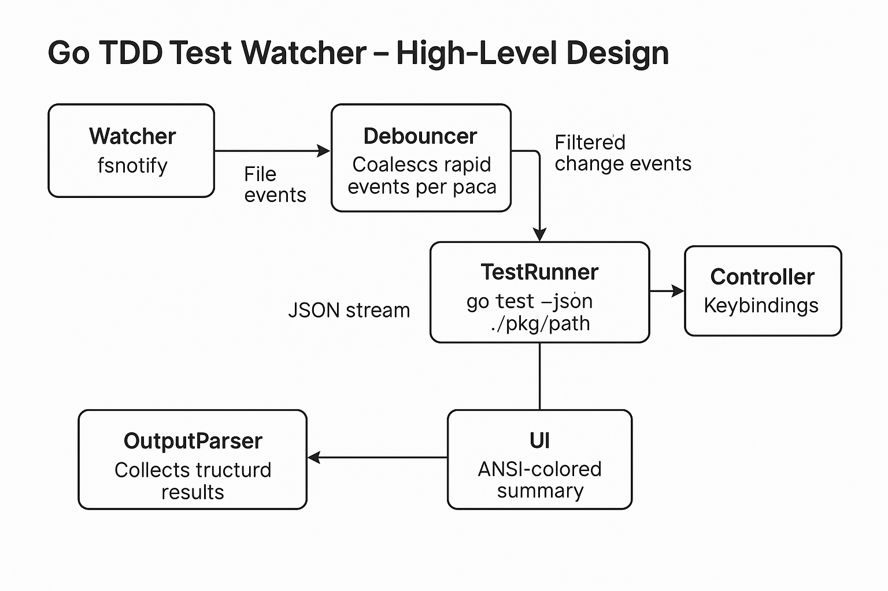
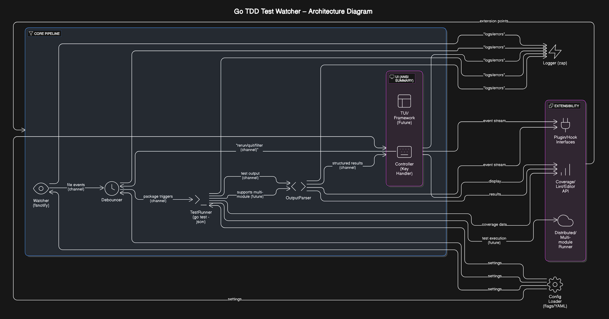

# Go TDD Test Watcher (Go Sentinel) – High-Level Design

The tool is a Go-native CLI daemon that continually watches source files, reruns tests on changes, and displays a concise colored summary. A high-level architecture is shown below:



**Figure:** High-level architecture of the CLI test watcher, with core components and data flow. The *fsnotify*-based Watcher scans directories (skipping vendor/generated files) and emits file events. A **Debouncer** stage coalesces rapid events per package (e.g. buffering writes and firing after \~100ms of quiet). Filtered change events (by package path) then trigger the **TestRunner**, which executes `go test -json ./pkg/path` via `os/exec` (capturing stdout/stderr pipes). Its JSON stream is fed to an **OutputParser** that collects structured results, which are pushed to the **UI**. The UI goroutine displays a concise ANSI-colored summary. Simple keybindings (Enter=rerun, “f”=filter failures, “q”=quit) are handled by a Controller. Components communicate over channels in a Go “pipeline” pattern. Structured logging (e.g. via Uber’s **zap**) is used throughout and each goroutine recovers from panics to keep the watcher alive.



**Figure:** Detailed architecture of the CLI test watcher, showing data flow between components. The Watcher emits file events, which are debounced per package. The TestRunner executes `go test -json` and feeds the JSON stream to the OutputParser. The UI displays a concise summary of test results. The Controller handles user input (e.g. Enter to rerun, “f” to toggle failure mode, “q” to quit). Components communicate over channels in a Go “pipeline” pattern. Structured logging (e.g. via Uber’s **zap**) is used throughout and each goroutine recovers from panics to keep the watcher alive.

## Efficient File Watching and Debounce

We use [fsnotify](https://github.com/fsnotify/fsnotify) (Go 1.17+ required) to watch directories recursively. On startup we walk the module root using `fs.WalkDir` (from `io/fs`) and call `watcher.Add` on each subdirectory, skipping any path under `vendor/` or other excludes. For example:

```go
func initWatcher(root string) (*fsnotify.Watcher, error) {
    watcher, err := fsnotify.NewWatcher()
    if err != nil {
        return nil, err
    }
    // Recursively watch all dirs
    fs.WalkDir(os.DirFS(root), ".", func(p string, d fs.DirEntry, err error) error {
        if err != nil {
            return err
        }
        // Skip vendor and hidden
        if d.IsDir() && (strings.HasPrefix(p, "vendor") || strings.HasPrefix(p, ".")) {
            return fs.SkipDir
        }
        if d.IsDir() {
            return watcher.Add(path.Join(root, p))
        }
        return nil
    })
    return watcher, nil
}
```

This ensures all Go packages are monitored. The watcher loop then reads `watcher.Events` and `watcher.Errors`. To avoid re-running tests on every tiny edit (or multiple saves), we debounce events per package path. A common approach is to buffer write/create events and invoke the test run only after no further events for, say, 100ms. For example:

```go
debounce := make(map[string]time.Time)
const quietDur = 100*time.Millisecond
for event := range watcher.Events {
    if event.Op&(fsnotify.Create|fsnotify.Write|fsnotify.Remove) == 0 {
        continue
    }
    pkg := determinePackage(event.Name) // e.g. via path.Dir or go list
    debounce[pkg] = time.Now()
}
// In another goroutine:
for {
    time.Sleep(quietDur)
    now := time.Now()
    for pkg, t0 := range debounce {
        if now.Sub(t0) > quietDur {
            triggerTest(pkg)  // send pkg to test runner
            delete(debounce, pkg)
        }
    }
}
```

This ensures that rapid file saves produce only one test run per package.

## Running Tests & Capturing Output

The **TestRunner** simply invokes `go test -json <pkg>` using `exec.Command`. For live output, we use `cmd.StdoutPipe()`/`StderrPipe()` and start the process; then scan its output line by line. The Go tool’s `-json` flag invokes `test2json` internally, streaming newline-delimited JSON events. For example:

```go
cmd := exec.Command("go", "test", "-json", pkg)
stdout, _ := cmd.StdoutPipe()
stderr, _ := cmd.StderrPipe()
if err := cmd.Start(); err != nil {
    logger.Error("test run failed to start", zap.Error(err))
}
// Read JSON lines concurrently
go io.Copy(os.Stderr, stderr) // print compile errors in real-time
scanner := bufio.NewScanner(stdout)
for scanner.Scan() {
    line := scanner.Text()
    outputCh <- line // send to parser
}
cmd.Wait()
```

Because `go test -json` streams JSON without extra buffering, we can process results as they arrive. Any compile or setup errors, however, may appear on stderr or as plain text on stdout. Notably, some build failures are emitted as non-JSON text (see below).

## Parsing `go test -json` Output

The **OutputParser** reads each JSON line from the test runner and unmarshals it into a Go struct mirroring `test2json` events. A typical struct is:

## Test Timeout and Deadlock Protection

Since Go Sentinel runs user code tests, the stability of our tool must not depend on the stability of the user's code. Tests with deadlocks, infinite loops, or other blocking issues must not cause Go Sentinel itself to hang or become unresponsive.

### Timeout Implementation

Go's test command has built-in timeout support, which we leverage and enhance:

1. **Global Test Timeout**: We apply a sensible default timeout using the `-timeout` flag when executing `go test`. This ensures all test execution eventually terminates, even if user code deadlocks:

```go
execCmd := exec.CommandContext(ctx, "go", "test", "-json", "-timeout=2m", "./...")  // 2-minute default
```

2. **Context-Based Cancellation**: We wrap test execution with a context that supports cancellation, giving Go Sentinel fine-grained control:

```go
ctx, cancel := context.WithTimeout(context.Background(), time.Duration(config.TestTimeoutSeconds) * time.Second)
defer cancel()
// Use ctx when creating the command
execCmd := exec.CommandContext(ctx, "go", "test", "-json", "./...")
```

3. **Graceful Termination**: When a timeout occurs, we ensure proper resource cleanup and provide users with helpful feedback:

```go
if errors.Is(err, context.DeadlineExceeded) {
    logger.Warn("Test execution timed out", zap.String("package", pkgPath))
    results <- TestResult{
        Package: pkgPath,
        Error: "Test execution timed out after " + config.TestTimeout.String(),
        TimedOut: true,
    }
}
```

### Deadlock Detection

Go's runtime includes automatic deadlock detection, but this can be suppressed by timeouts. Our approach ensures users get meaningful information:

1. **Capture Runtime Messages**: Parse stderr output looking for deadlock indicators:

```go
if strings.Contains(errOutput, "all goroutines are asleep - deadlock!") {
    results <- TestResult{
        Package: pkgPath,
        Error: "Deadlock detected in tests",
        DeadlockDetected: true,
    }
}
```

2. **Resource Monitoring**: We track resource usage patterns that might indicate deadlocks even when Go's detection is bypassed:

```go
go func() {
    ticker := time.NewTicker(5 * time.Second)
    defer ticker.Stop()
    
    var lastOutput time.Time
    for {
        select {
        case <-ctx.Done():
            return
        case <-ticker.C:
            if time.Since(lastOutput) > 30*time.Second && cmdRunning {
                logger.Warn("No output for 30 seconds, possible test hang",
                    zap.String("package", pkgPath))
            }
        case <-outputReceived:
            lastOutput = time.Now()
        }
    }
}()
```

### Configuration Options

Users can customize timeout behavior through configuration:

- `test-timeout`: Override the default timeout duration (default: 2m)
- `test-quiet-threshold`: Duration without output before warning about possible hang (default: 30s)
- `test-disable-timeout`: Disable timeouts altogether (not recommended, but useful for debugging)

This approach ensures Go Sentinel remains responsive and provides useful feedback even when facing challenging test scenarios in user code.

```go
type TestEvent struct {
    Time       time.Time `json:"Time"`
    Action     string    `json:"Action"`
    Package    string    `json:"Package"`
    Test       string    `json:"Test,omitempty"`
    Elapsed    float64   `json:"Elapsed,omitempty"`
    Output     string    `json:"Output,omitempty"`
    Failed     bool      `json:"Failed,omitempty"`
    // The `FailedBuild` field contains pkg-level errors (e.g. missing imports)
    FailedBuild string    `json:"FailedBuild,omitempty"`
}
```

According to the Go docs, each JSON event has an `Action` (one of `start`, `run`, `pass`, `fail`, `output`, `skip` etc.). We look for `Action=="pass"` or `"fail"` to mark test results, collecting failures and their error output. If a line fails to parse as JSON (e.g. a compile error), we log it or attach it to the package’s failure summary. We group events by package/test name and accumulate durations and output. For example, on seeing:

```json
{"Time":"...","Action":"run","Package":"mypkg","Test":"TestAdd","Elapsed":0}
{"Time":"...","Action":"pass","Package":"mypkg","Test":"TestAdd","Elapsed":0.003}
```

we record `TestAdd` as passed (duration 3ms). On failure events, we capture `Output` lines which include the file\:line and error message, so we can later display code context.

## Terminal UI Design

The CLI output is a hybrid live-summary. We render ANSI-colored text (for Windows, libraries like [fatih/color](https://github.com/fatih/color) simplify this). Key UI features:

* **Summary lines:** For each test we display an icon and color: e.g. green “✔ PASS” or red “✖ FAIL” followed by the test name and duration. Example snippet:

  ```go
  if res.Passed {
      fmt.Printf("\x1b[32m✔ PASS\x1b[0m %s (%.2fs)\n", res.Name, res.Duration)
  } else {
      fmt.Printf("\x1b[31m✖ FAIL\x1b[0m %s (%.2fs)\n", res.Name, res.Duration)
      fmt.Printf("    %s:%d: %s\n", res.File, res.Line, res.Message)
  }
  ```
* **Failure details:** For failed tests, we show the test name, source file\:line (from the parser’s output), and a small code snippet (e.g. 2 lines of context around the error). This may require scanning the source file to extract context.
* **Interactivity:** We listen for stdin keypresses with the following controls:
  * Enter: Rerun tests (re-triggering the last changed pkg)
  * "f": Toggles filter mode to display only failures
  * "c": Quick copy of all failed test information to clipboard
  * "C": Enter selection mode for choosing specific test failures to copy
    * Space: Toggle selection of a test under cursor
    * Arrow keys: Navigate between tests
    * Enter: Copy selected tests and return to main view
    * Esc: Cancel selection and return to main view
  * "q": Quits the application

  We'll implement clipboard integration using platform-specific methods (e.g., `clip` on Windows, `pbcopy` on macOS, `xclip`/`xsel` on Linux). For the selection UI, we'll use ANSI codes to highlight the cursor position and selected items with visual indicators. In a full TUI we'd use raw mode or a library, but even simple `bufio.NewReader(os.Stdin)` and terminal escape toggles can work. Future versions might use a TUI framework like [Bubble Tea](https://github.com/charmbracelet/bubbletea) or \[tview], but for MVP ANSI output with simple key handling is sufficient.

Output is updated on each run, but the program never exits on test errors (panics or compile failures just show as errors and continue watching).

## Concurrency and Resilience

The program is built as concurrent pipeline stages:

* **Watcher goroutine:** reads fsnotify events and sends package paths into a channel.
* **Debouncer goroutine:** collects incoming events, debounces them, and sends final package triggers to the runner.
* **Runner goroutine(s):** sequentially executes `go test` (we might allow one per module at a time, or parallelize by package).
* **Parser goroutine:** decodes JSON lines and sends result structs to the UI.
* **UI goroutine:** prints summary and handles keypress events.

Each stage reads from an input channel and writes to an output channel, reflecting Go’s “pipelines” pattern. For example, the watcher→debouncer→runner chain is a pipeline of stages. We also use a `select` loop where needed (e.g. watching `ctx.Done()` to exit).

We ensure resilience: each goroutine defers a `recover()` to catch panics, log them (via zap), and keep the pipeline alive. For example:

```go
go func() {
    defer func() {
        if r := recover(); r != nil {
            logger.Error("Watcher panicked", zap.Any("error", r))
        }
    }()
    watchLoop() // blocks reading events
}()
```

Similarly, if `go test` fails (compile error), we log it but do not crash. We may serialize such errors into the UI (e.g. showing “BUILD FAILED” in red).

## Configuration

We provide both CLI flags and an optional `watcher.yaml` for configuration. Options include:

* **Includes/Excludes:** patterns for directories or files to include/ignore (by default exclude `vendor/`, `testdata/`, autogenerated files).
* **Debounce interval:** e.g. `--debounce 100ms`.
* **Color on/off:** e.g. `--no-color`.
* **Verbosity:** enable structured logs (using zap’s log levels).
* **Package scope:** by default watch the current module; flags could limit to certain sub-packages.
* The YAML (or JSON) config might mirror these flags. Implementation can use `flag`/`cobra` or libraries like \[spf13/viper] for config file parsing.

Configuration is loaded at startup, validated, and then drives what `initWatcher` excludes or how long the debounce waits. For example:

```yaml
exclude: ["vendor", "testdata", ".git"]
debounce: 200ms
color: true
```

## Extensibility

To allow future growth:

* **Plugin hooks:** Define interfaces or callbacks so that plugins can inspect test results or modify behavior. For example, after parsing, we could emit an event channel that any listener can subscribe to. Or support external tools by shelling out.
* **Additional tooling:** We can add modes or commands:

  * **Coverage:** After a test run, gather coverage (e.g. `go test -coverprofile=…`) and display a summary or serve HTML reports.
  * **Lint integration:** On file changes, run linters (via `golangci-lint run`) and display warnings alongside tests.
  * **Editor integration:** Support remote API or notify (e.g. via [Language Server Protocol](https://microsoft.github.io/language-server-protocol/)) to highlight failures in editors.
* **TUI:** In future phases we might embed a full-screen TUI (using [tview](https://github.com/rivo/tview) or Bubble Tea), enabling navigation through test results, filtering with keystrokes, etc.
* **Test rerun granularity:** Extend to rerun individual tests (`go test -run=TestName`) rather than whole package, once parsing identifies exactly which test failed.
* **Custom test reporters:** Allow registering new output formats (e.g. summary dashboards, JSON logs, etc.).

## Roadmap

1. **MVP (Phase 1):**

   * Single-module support (no multi-module workspace).
   * Watch all `.go` files (excluding vendor/generated).
   * On any change in a package, rerun `go test` for that package.
   * ANSI-colored summary: green ✔ for passes, red ✖ for fails.
   * Only coarse output (no per-test details beyond name, status, duration).
   * Basic key handling (Enter to rerun last, q to quit).
   * Error resilience (don’t crash on compile errors).

2. **Phase 2:**

   * **JSON parsing:** Parse `go test -json` output fully and store per-test data.
   * **Per-test reruns:** After initial run, on a failing test change, rerun just that test (`go test -run=Name`) for faster feedback.
   * **Enhanced UI:** Offer an (embedded) TUI mode where user can navigate test results, toggle failure-only view (filter 'f'), scroll stack traces, etc.
   * **Config file support:** `watcher.yaml` with include/exclude globs, debounce tuning, etc.

3. **Phase 3:**

   * **Plugin architecture:** Allow external plugins or scripts to hook into events (tests start/end, file change, etc.).
   * **Coverage and analysis:** Integrate code coverage display, maintain historical pass rates, track code quality metrics.
   * **Editor/IDE integration:** Provide an API or protocol for editors to trigger tests on save and display results inline.
   * **Distributed/multi-module:** Support multi-module projects or remote test runners (for CI mirroring).

## Key Features (Prioritized)

* **🚀 Core:** File watch (fsnotify), debounce, run `go test`, parse JSON, color output.
* **🔄 Efficiency:** Minimal latency between save and feedback, grouping rapid changes.
* **🔐 Resilience:** Does not exit on error; logs with zap.
* **🧩 Configurable:** Exclude patterns, debounce timeout, on/off ANSI, via flags or YAML.
* **🔑 UI:** Inline keyboard controls (Enter, f, q); ANSI color (via fatih/color or raw codes).
* **📦 Packaging:** Should compile to a single binary (`testwatcher`) installable via `go install`.
* **⚙️ Future:** Plugin hooks, per-test runs, coverage/lint modes, full TUI.

## Example Code Snippets

**Watcher loop (fsnotify + debouncing):**

```go
watcher, _ := fsnotify.NewWatcher()
defer watcher.Close()
// (Initialize watchers on dirs...)
debounce := map[string]time.Time{}
go func() {
    for {
        select {
        case ev := <-watcher.Events:
            if ev.Op&(fsnotify.Write|fsnotify.Create|fsnotify.Remove) != 0 {
                pkg := pkgFromPath(ev.Name)
                debounce[pkg] = time.Now()
            }
        case err := <-watcher.Errors:
            logger.Error("watch error", zap.Error(err))
        }
    }
}()
// Debounce loop
go func() {
    for {
        time.Sleep(100*time.Millisecond)
        now := time.Now()
        for pkg, t0 := range debounce {
            if now.Sub(t0) > 100*time.Millisecond {
                eventCh <- pkg
                delete(debounce, pkg)
            }
        }
    }
}()
```

**Parsing JSON events into results:**

```go
type TestEvent struct {
    Action  string  `json:"Action"`
    Package string  `json:"Package"`
    Test    string  `json:"Test"`
    Elapsed float64 `json:"Elapsed"`
    Output  string  `json:"Output"`
}
// ...
var ev TestEvent
if err := json.Unmarshal([]byte(line), &ev); err != nil {
    // handle non-JSON (build error)
    continue
}
switch ev.Action {
case "pass":
    results[ev.Test] = &TestResult{Name: ev.Test, Passed: true, Duration: ev.Elapsed}
case "fail":
    r := results[ev.Test]
    r.Passed = false
    r.Duration = ev.Elapsed
case "output":
    if !results[ev.Test].Passed {
        results[ev.Test].OutputLines = append(results[ev.Test].OutputLines, ev.Output)
    }
}
```

**Minimal UI update (colorized print):**

```go
for _, res := range sortedResults {
    if res.Passed {
        fmt.Printf("\x1b[32m✔ PASS\x1b[0m %s (%.2fs)\n", res.Name, res.Duration)
    } else {
        fmt.Printf("\x1b[31m✖ FAIL\x1b[0m %s (%.2fs)\n", res.Name, res.Duration)
        for _, out := range res.OutputLines {
            fmt.Printf("    %s\n", out)
        }
    }
}
// Key handling (simplified)
input, _ := reader.ReadByte()
switch input {
case '\r': triggerRerun()
case 'f': toggleFailuresOnly()
case 'q': cancelContext()
}
```

## Proposed Package Layout

A clean separation of concerns might use packages like:

```
cmd/testwatcher/main.go       # CLI entrypoint (flag parsing, setup)
internal/watcher/watcher.go   # fsnotify logic, recursive watching, debouncing
internal/runner/runner.go     # Executes go test -json, streams output
internal/parser/parser.go     # Parses JSON into test results structs
internal/ui/ui.go             # Rendering logic (ANSI output), key handling
internal/config/config.go     # Reads flags/yaml, holds options
internal/event/event.go       # Defines event/result types shared across packages
```

This modular structure (or similar) uses Go best-practices of small, focused packages. Each core component (Watcher, Runner, Parser, UI) is testable in isolation, and the `cmd/testwatcher` ties them together.

**References:** We rely on fsnotify for filesystem events, the `go test -json` output format for structured test results, and the Go concurrency “pipeline” pattern for channel orchestration. For colored terminal output we can use ANSI codes, and for logging we use zap. The debounce strategy is inspired by community examples.
